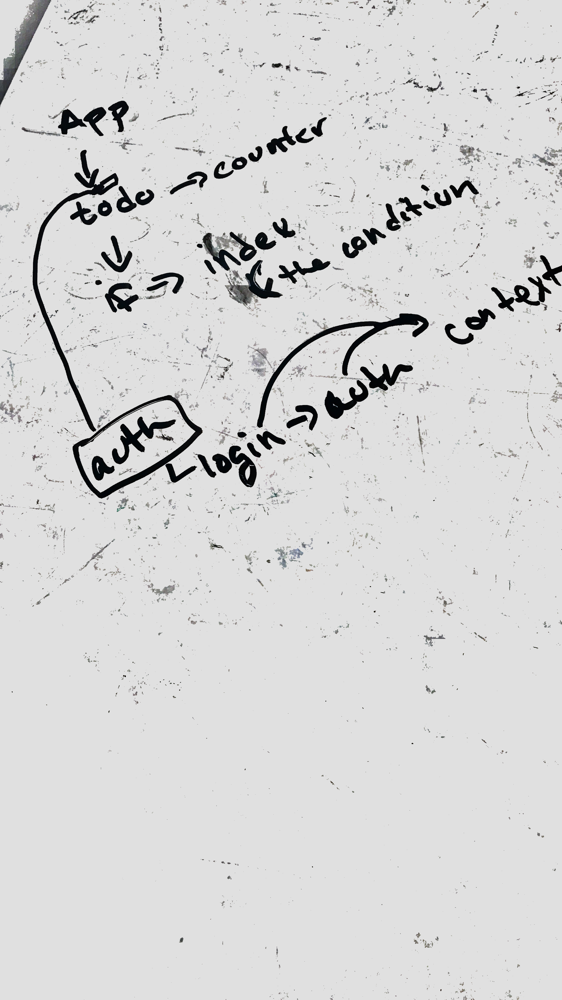

# LAB - 34

## ToDo list- Auth

### Author: Liz Kavalski

### Links and Resources
* [submission PR](http://xyz.com))
* [back-end](https://api-js401.herokuapp.com) (class-server)
* [front-end](https://codesandbox.io/s/class-34-starter-code-todo-q1sxu)

### Modules
#### `todo.js`
Shows the to-do list based on the user
#### `index.js`
Has the components that allows conditional of 'If', 'Then','Else', and 'When'
#### `counter.js`
Counts how many items are in the to-do list
#### `login.js`
Allow users to login
#### `context.js`
Vaildate the tokens and set a cookie that allow the user to stay sign-in
#### `auth.js`
Based on the the capabilities the user has reader those capabilties

### Setup
#### `.env` requirements
* REACT_APP_API_LIVE= a link to the auth server
* REACT_APP_SECRET= made-up word

#### Running the app
Put a user name and password into the login form. the usernames and password are: user:USER, editor:EDITOR and admin:ADMIN
#### Tests
no test

#### UML

